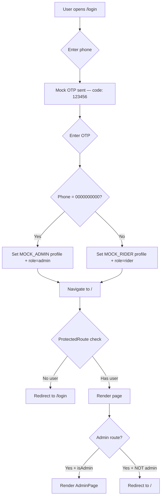
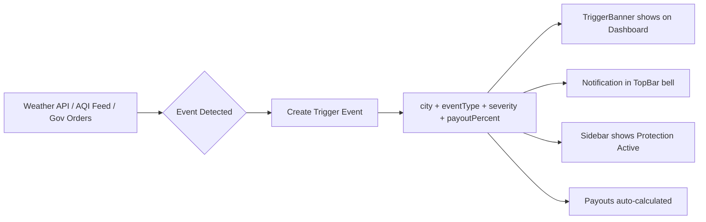

# GigShield — System Architecture

> **AI-powered parametric income protection for gig-economy delivery riders.**

---

## 1. Product Overview

GigShield is a **parametric insurance web application** designed for delivery riders (Swiggy, Zomato, Blinkit). It automatically detects adverse events — **heavy rain, poor air quality (AQI), or government curfews** — and compensates riders for lost income without requiring them to file a manual claim.

### Core Concept: Parametric Insurance

Unlike traditional insurance where riders must prove losses, GigShield uses **predefined trigger parameters** (e.g., rainfall > threshold → automatic payout). When a trigger event is detected in a rider's city, the system calculates the income shortfall and disburses a percentage-based payout instantly.

### Key Features

| Feature | Description |
|---------|-------------|
| **Trigger-based Protection** | Real-time monitoring of rain, AQI, and curfew events per city |
| **Insurance Score** | AI-calculated score (0–100) based on activity, stability, and claim history |
| **Automatic Payouts** | Income protection payouts triggered without manual claims |
| **Pool System** | ₹1 per delivery goes into a communal insurance pool |
| **Emergency Loans** | Score-based eligibility for emergency micro-loans (score ≥ 60) |
| **Tax Report** | Annual FY income summary with downloadable PDF |
| **Admin Dashboard** | Operations panel with pool ledger, rider management, and event monitoring |

---

## 2. Technology Stack

```
┌─────────────────────────────────────────────────────┐
│                    Frontend                          │
│  React 18  ·  React Router 6  ·  Vite 5             │
│  TailwindCSS 3  ·  Recharts  ·  Lucide Icons        │
│  jsPDF  ·  react-hot-toast                           │
└─────────────────────────────────────────────────────┘
```

| Layer | Technology | Purpose |
|-------|-----------|---------|
| **Framework** | React 18 (JSX) | Component-based UI |
| **Router** | React Router Dom v6 | Client-side SPA routing |
| **Build Tool** | Vite 5 | Dev server, HMR, production bundling |
| **Styling** | TailwindCSS 3 + Custom CSS Variables | Utility-first styling with dark theme design system |
| **Charts** | Recharts | Area charts, bar charts, pie charts, radial gauges |
| **Icons** | Lucide React | Modern SVG icon library |
| **PDF** | jsPDF | Client-side tax report generation |
| **Toasts** | react-hot-toast | Notification toasts |
| **Typography** | Google Fonts (Plus Jakarta Sans, Syne, JetBrains Mono) | Custom font stack |
| **Backend** | *(Mock data — Firebase placeholder)* | Currently runs entirely on mock data |

---

## 3. High-Level Architecture

```
┌──────────────────────────────────────────────────────────────────────┐
│                         Browser (Client)                             │
│                                                                      │
│  ┌──────────┐     ┌───────────────────────────────────────────────┐  │
│  │  Vite    │────►│              React App (SPA)                  │  │
│  │  Dev     │     │                                               │  │
│  │  Server  │     │  ┌─────────────────────────────────────────┐  │  │
│  └──────────┘     │  │  AuthContext (Global State)              │  │  │
│                   │  │  ├── currentUser                         │  │  │
│                   │  │  ├── riderProfile                        │  │  │
│                   │  │  └── isAdmin                             │  │  │
│                   │  └──────────────┬──────────────────────────┘  │  │
│                   │                 │                              │  │
│                   │     ┌───────────┴───────────┐                 │  │
│                   │     │  React Router v6       │                 │  │
│                   │     │  ┌─────────────────┐   │                 │  │
│                   │     │  │ /login           │   │                 │  │
│                   │     │  │ /register        │   │                 │  │
│                   │     │  │ / (Dashboard)    │   │                 │  │
│                   │     │  │ /payouts         │   │                 │  │
│                   │     │  │ /coverage        │   │                 │  │
│                   │     │  │ /tax             │   │                 │  │
│                   │     │  │ /profile         │   │                 │  │
│                   │     │  │ /admin           │   │                 │  │
│                   │     │  └─────────────────┘   │                 │  │
│                   │     └─────────────────────────┘                │  │
│                   │                                               │  │
│                   │  ┌──────────────────────────────────────────┐  │  │
│                   │  │           Data Layer (Hooks)              │  │  │
│                   │  │  useDeliveries · usePayouts              │  │  │
│                   │  │  useTriggerEvents · useRiderData         │  │  │
│                   │  │          ▼                                │  │  │
│                   │  │   mockData.js (In-Memory Store)           │  │  │
│                   │  └──────────────────────────────────────────┘  │  │
│                   └───────────────────────────────────────────────┘  │
└──────────────────────────────────────────────────────────────────────┘
```

---

## 4. Application Shell & Layout System

The app uses a **sidebar-based desktop layout** wrapped in `AppShell`:

```
┌────────────────────────────────────────────────────────────┐
│ Sidebar (240px)  │          TopBar (sticky)                │
│  ┌────────────┐  │  ┌──────────────────────────────────┐   │
│  │ Logo       │  │  │ Page Title   [Search] [🔔] [👤]  │   │
│  │ Event      │  │  └──────────────────────────────────┘   │
│  │ Banner     │  │                                         │
│  │            │  │          Page Content                    │
│  │ Dashboard  │  │    ┌────────────────────────────────┐   │
│  │ Payouts    │  │    │  (max-width: 1280px)           │   │
│  │ Coverage   │  │    │                                │   │
│  │ Tax Report │  │    │   Route-specific page          │   │
│  │ Profile    │  │    │   rendered here                │   │
│  │ [Admin]    │  │    │                                │   │
│  │            │  │    └────────────────────────────────┘   │
│  │ ──────────│  │                                         │
│  │ User Card  │  │                                         │
│  └────────────┘  │                                         │
└────────────────────────────────────────────────────────────┘
```

- **Auth pages** (`/login`, `/register`) render **without** the sidebar/topbar shell.
- **Protected pages** render inside the shell with sidebar + topbar.
- **Admin page** (`/admin`) requires both authentication AND `role === 'admin'`.

---

## 5. Authentication & Authorization Flow



**Key points:**
- Authentication is **fully mocked** — no real Firebase backend.
- OTP is hardcoded to `123456`.
- Admin login is triggered by phone number `0000000000`.
- Session state lives in React Context (`AuthContext`) — not persisted across refreshes.

---

## 6. Data Architecture

### Data Source: Mock Data Store (`mockData.js`)

All data is **in-memory mock data** with no backend persistence. The mock store provides:

| Data Entity | Description | Records |
|-------------|-------------|---------|
| `MOCK_RIDER` | Default rider profile (Ravi Kumar, Chennai, Swiggy) | 1 |
| `MOCK_ADMIN` | Admin profile (extends MOCK_RIDER with role=admin) | 1 |
| `MOCK_TRIGGER_EVENTS` | Active weather/AQI/curfew events per city | 1 active |
| `MOCK_PAYOUTS` | Historical payout records (rain, AQI, curfew) | 4 |
| `MOCK_DELIVERIES` | 7 days of generated delivery records | ~42 |
| `MOCK_WEEKLY_EARNINGS` | Aggregated daily earnings for past 7 days | 7 |
| `MOCK_SCORE_HISTORY` | 8-week insurance score progression | 8 |
| `MOCK_HOURLY_DELIVERIES` | Hourly delivery heatmap data | 18 hours |
| `MOCK_MONTHLY_PAYOUTS` | 12-month earnings + payouts for tax chart | 12 |
| `MOCK_ALL_TRIGGER_EVENTS` | All events (active + ended) for admin | 4 |
| `MOCK_ALL_RIDERS` | Full rider roster for admin | 6 |
| `MOCK_POOL_LEDGER` | Per-city pool inflow/outflow/balance | 3 cities |

### Custom Hooks (Data Access Layer)

Hooks abstract mock data access and would be swapped to Firestore calls in production:

| Hook | Returns | Notes |
|------|---------|-------|
| `useAuth()` | `{currentUser, riderProfile, isAdmin, loading}` | From AuthContext |
| `useDeliveries(riderId, start, end)` | `{deliveries, totalEarnings, deliveryCount, addDelivery}` | Supports date filtering + adding new deliveries |
| `usePayouts(riderId)` | `{payouts, loading, hasMore}` | Returns MOCK_PAYOUTS |
| `useTriggerEvents(city)` | `{events, loading}` | Filters active events by city |
| `useRiderData()` | `{riderData, loading, error}` | Proxies to riderProfile from context |

---

## 7. Routing Map

| Route | Component | Auth Required | Admin Only | Description |
|-------|-----------|:---:|:---:|-------------|
| `/login` | `LoginPage` | ❌ | ❌ | Phone + OTP login |
| `/register` | `RegisterPage` | ❌ | ❌ | New rider onboarding (name, city, platform, nominee) |
| `/` | `HomePage` | ✅ | ❌ | Main dashboard — earnings, 7-day trend, heatmap, score, payouts |
| `/payouts` | `PayoutsPage` | ✅ | ❌ | Payout history, filters, donut chart, timeline view |
| `/coverage` | `CoveragePage` | ✅ | ❌ | Insurance score details, breakdown, history chart, loan eligibility |
| `/tax` | `TaxSummaryPage` | ✅ | ❌ | FY tax summary, monthly chart, PDF download |
| `/profile` | `ProfilePage` | ✅ | ❌ | Personal info, nominee management, sign out |
| `/admin` | `AdminPage` | ✅ | ✅ | Events table, pool ledger, rider management |
| `*` | Redirect to `/` | — | — | Catch-all redirect |

---

## 8. Insurance Score System

The insurance score (0–100) determines a rider's protection level and loan eligibility:

```
┌─────────────────────────────────────────────────────┐
│              Insurance Score (0–100)                  │
│                                                       │
│  ┌─────────────────────┐                              │
│  │ Activity     (40 pts)│ Deliveries + active days    │
│  ├─────────────────────┤                              │
│  │ Stability    (30 pts)│ 90-day earnings consistency │
│  ├─────────────────────┤                              │
│  │ Claim History(30 pts)│ Accurate claims, low fraud  │
│  └─────────────────────┘                              │
│                                                       │
│  Score Tiers:                                         │
│   0-39  → Poor (red)    │ No loans                   │
│  40-59  → Fair (amber)  │ No loans                   │
│  60-79  → Good (blue)   │ ₹5,000–₹7,500 loan        │
│  80-100 → Excellent (green) │ ₹10,000 loan           │
└─────────────────────────────────────────────────────┘
```

---

## 9. Trigger Event System

Events are parametric triggers that activate income protection:



### Event Types & Severity

| Event Type | Severities | Payout Range | Colors |
|-----------|------------|:---:|--------|
| **Rain** | mild, moderate, severe | 30–80% | Blue gradient |
| **AQI** | moderate, severe | 60–80% | Amber gradient |
| **Curfew** | partial, full | 70–80% | Red gradient |

### Payout Calculation

```
payoutAmount = (expectedIncome - actualIncome) × (payoutPercent / 100)
```

---

## 10. Pool / Micro-Insurance Economics

```
┌────────────────────────────────────────────────────────┐
│                   Pool System                           │
│                                                         │
│  INFLOW:  ₹1 deducted per delivery across all riders   │
│           → Goes to city-level pool                     │
│                                                         │
│  OUTFLOW: Payouts disbursed from pool during events     │
│                                                         │
│  HEALTH:  Reserve Ratio = Pool Balance / Pending Payouts│
│           ≥ 3×  → Healthy (green)                       │
│           1–3×  → Moderate (amber)                      │
│           < 1×  → Critical (red)                        │
└────────────────────────────────────────────────────────┘
```

---

## 11. Design System

### Color Palette (CSS Custom Properties)

| Variable | Hex | Usage |
|----------|-----|-------|
| `--bg` | `#0A0F1E` | App background — deep navy |
| `--surface` | `#111827` | Card backgrounds |
| `--surface2` | `#1A2235` | Elevated surfaces |
| `--border` | `rgba(255,255,255,0.07)` | Subtle borders |
| `--text` | `#F1F5F9` | Primary text |
| `--text2` | `#94A3B8` | Secondary text |
| `--text3` | `#64748B` | Muted text |
| `--blue` / `--blue-bright` | `#3B82F6` / `#60A5FA` | Primary accent |
| `--green` / `--green-bright` | `#10B981` / `#34D399` | Success / money |
| `--amber` | `#F59E0B` | Warning |
| `--red` | `#EF4444` | Error / danger |

### Typography

| Font | Weight | Usage |
|------|--------|-------|
| **Plus Jakarta Sans** | 300–800 | Body text, labels, buttons |
| **Syne** | 600–800 | Headings, large numbers, branding |
| **JetBrains Mono** | 400–600 | Monetary values, phone numbers, codes |

### Animations

| Animation | Duration | Usage |
|-----------|----------|-------|
| `slide-up` | 0.35s | Card/modal entry |
| `slide-down` | 0.2s | Dropdown entry |
| `fade-in` | 0.2s | Backdrop, general fade |
| `float` | 3s (infinite) | Logo on login page |
| `pulse-ring` | 2s (infinite) | Notification dot, live indicators |
| `stagger` | Children with 0.04–0.29s delay | Page section cascading entry |

---

## 12. Production Readiness Notes

### What's Mock (needs real backend)

- ❌ Phone OTP authentication (replace with Firebase Auth or equivalent)
- ❌ All data from `mockData.js` (replace hooks with Firestore queries)
- ❌ Weather/AQI/Curfew event detection (needs external API integration)
- ❌ Payout disbursement (Razorpay integration referenced but not connected)
- ❌ Session persistence (currently lost on page refresh)
- ❌ PDF tax data (uses mock figures)

### What's Production-Ready

- ✅ Complete UI/UX with responsive dark-mode design
- ✅ Component architecture (reusable cards, charts, layout)
- ✅ Routing with auth guards
- ✅ Score calculation + visualization
- ✅ PDF generation pipeline
- ✅ Admin operations dashboard
- ✅ Design system with consistent theming
